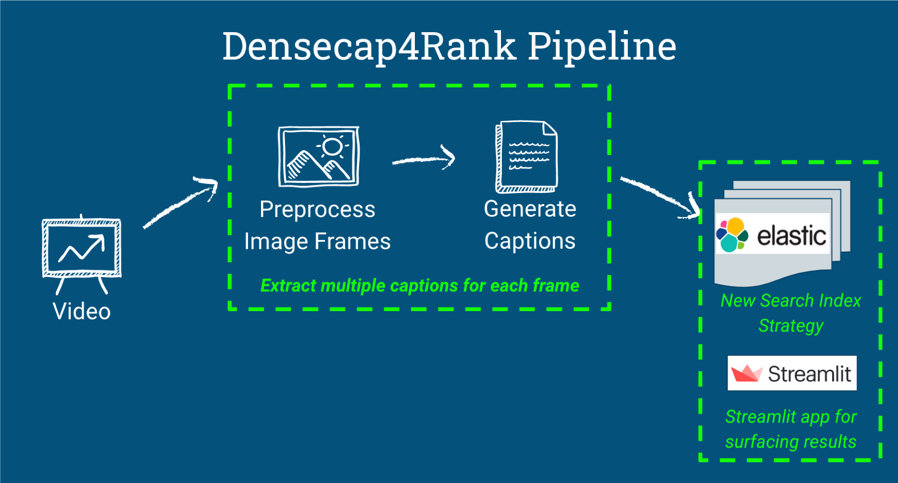

# Densecap4Rank (Deep captioning for video ranking)
This repository implements a novel method for ranking videos used for video recommender systems. Currently, video recommender systems rely heavily on content-based and collaborative filtering. Both user-based and content-based collaborative filtering is dependent on click/use information and user information. This leads to an issue called the "cold-start" problems for new users who lack prior interaction with the recommender system. When a new user joins or a new piece of content is added to the platform, the recommender system lacks prior information for relevent suggestion for the user. Some common techniques for solving this problem include: surveying new users, drawing connections via social media accounts, or representative-based methods by identify most relevant users to make recommendations. Prior open-source solutions include work from Cherie Lu (AI.SV.19B), Demo + Code, and Araks Stepanyan (AI.SV.19B) Demo. These approaches both looked at individual video frames for generating single captions and features respectively to extract semantic data for videos. In this project dense captioning is used to extract multiple captions per frame and an Elasticsearch framework is used for indexing and searching based a user query. The approach taken in this problems involves extracting rich semantics directly from videos, index and search over semantics (+ metadata) via Elasticsearch.

The pipeline for project involves (shown in the diagram below):

1. Extract individual frames from videos based on a specificed temporal resolution.
2. Identify multiple regions of interest (ROIs) per frame and extract generate caption for each ROI using dense captioning.
3. Generate an Elasticsearch index using the metadata and generated captions.
4. Recommend video content to users based on the ranking based a search query (implemented in a streamlit application).

__Dense caption generation__

The multiple captions (or dense captions) are generated using the dense captioning framework originally developed by Justin Johnson from Stanford University ([Dense Captioning](https://github.com/jcjohnson/densecap)). The architecture uses (1) localization layer to determine region proposals, followed by (2) recognition network for region proposal updating and feature generation, and (3) LSTM language model for captions generation. By using a dense captioning model, more information is obtain for each frame compared to previous single caption implementations.

__Elasticsearch__

Elasticsearch is a highly scalable and open-source platform which provides near real-time search. It uses an inverted index database which enable search using Term Frequency (tf) and Inverse Document Frequency (idf) to calculate the similarity between documents and a search query (i.e., Lucene's Practical Scoring Function). The Elasticsearch server can be downloaded [here](https://github.com/elastic/elasticsearch).

__Installation__

...
